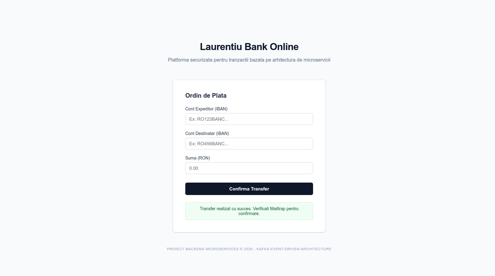
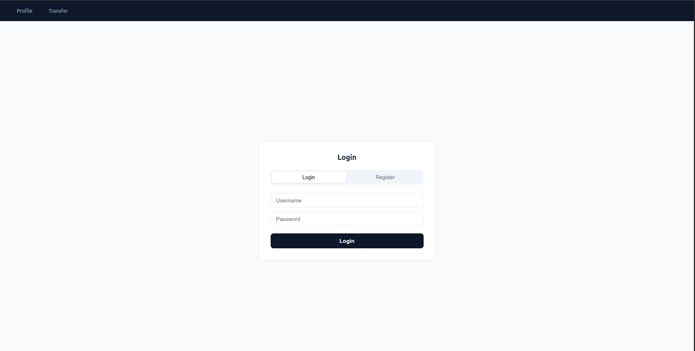

# Microservices Banking System
# V2 JWT


##  Application Preview


## V2 JWT Integration and UI modifies



A complete distributed banking system built to demonstrate Event-Driven Architecture and asynchronous communication.

Technologies Used
Backend: Java 21, Spring Boot 3
Messaging: Apache Kafka
Databases: PostgreSQL (separate for Accounts and Transactions)
Containerization: Docker & Docker Compose
Frontend: React.js (Axios for API communication)
Notifications: Mailtrap Integration (SMTP)

System Architecture
Accounts Service: Manages balances and initiates transfers.
Transactions Service: Listens to Kafka events and maintains the transaction history.
Logs Service: Sends email confirmations as soon as an event is detected in Kafka.

```bash
docker compose up --build
